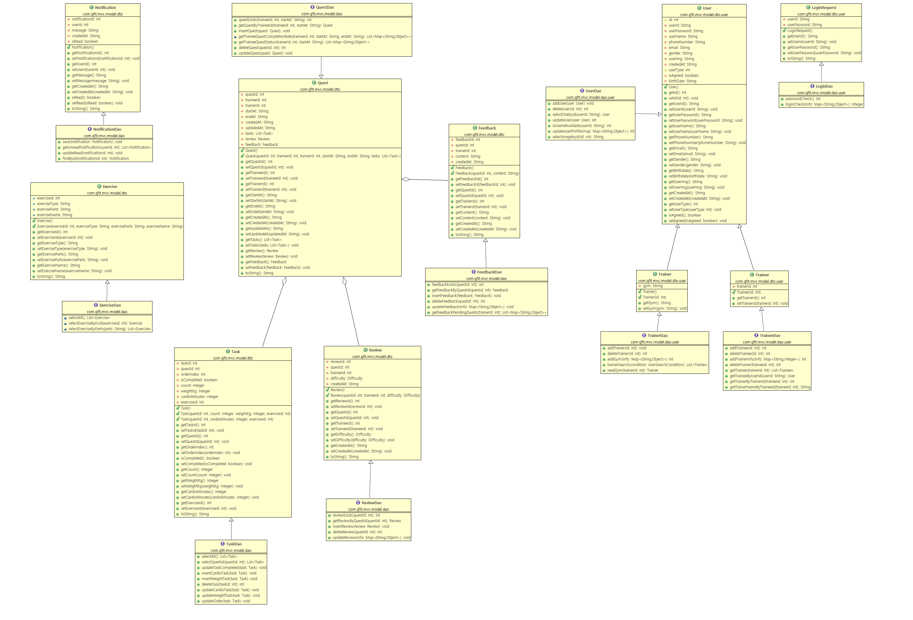

# **QFit - 피트니스 관리 플랫폼** 🏋️‍♂️

QFit은 **회원, 트레이너, 리뷰 등의 관리를 위한 REST API를 제공하는**  
Spring Boot 기반의 **피트니스 관리 애플리케이션**입니다.

---

## 🚀 **프로젝트 개요**

- **프로젝트명**: QFit  
- **기능**: 회원 관리, 트레이너 관리, 리뷰 작성 및 조회, 태스크 관리  
- **백엔드**: Spring Boot, MySQL, Swagger  
- **프론트엔드**: Vue 3 (Composition API)

---

## 📂 **프로젝트 구조**

### **📌 백엔드**
- **`src/main/java/com/qfit/mvc`**
  - **QfitApplication.java** → 애플리케이션 실행 엔트리 포인트
  - **config** → DB 및 Swagger 설정 파일  
    - `DBConfig.java` → 데이터베이스 설정  
    - `SwaggerConfig.java` → API 문서화 설정  
  - **controller** → REST API 컨트롤러  
    - `ReviewController.java`, `TaskRestController.java` → 리뷰 및 태스크 API  
    - `MemberRestController.java` → 일반 회원 관리 API  
    - `TraineeRestController.java` → 트레이니(훈련생) API  
    - `TrainerRestController.java` → 트레이너 API  
  - **model/dao** → 데이터베이스 액세스 객체 (DAO)  
    - `ReviewDao.java` → 리뷰 관련 DB 처리  

### **📌 클래스 다이어그램**
프로젝트 주요 클래스와 관계를 시각적으로 나타낸 다이어그램입니다.  


---

## ⚙️ **설정 및 실행 방법**

### **1️⃣ 요구 사항**
- **JDK 11+**
- **Maven**
- **MySQL**

### **2️⃣ 환경 설정**
- `DBConfig.java`에서 **데이터베이스 연결 정보 설정**
- `application.properties` 파일에서 DB URL, 사용자명, 비밀번호 입력

### **3️⃣ 프로젝트 빌드 및 실행**
```bash
# 프로젝트 디렉토리에서 빌드 후 실행
./mvnw spring-boot:run
```
> **기본 실행 주소**: `http://localhost:8080`

---

## 📖 **Swagger API 문서**

### **Swagger UI 접근**
> **서버 실행 후 아래 링크에서 API 문서를 확인할 수 있습니다.**
- **Swagger UI**: [http://localhost:8080/swagger-ui.html](http://localhost:8080/swagger-ui.html)

---

## 🏋️‍♂️ **주요 기능**
- ✅ **회원 관리** → 회원 가입, 로그인, 정보 수정  
- ✅ **리뷰 관리** → 회원 및 트레이너에 대한 리뷰 작성 및 조회  
- ✅ **트레이너 관리** → 트레이너 등록, 정보 조회  
- ✅ **태스크 관리** → 피트니스 관련 태스크 생성 및 관리  

---

# **qfit-front (Vue 3)** 🎨

이 프로젝트는 **Vue 3 (Composition API)**를 활용하여 구현된 프론트엔드 템플릿입니다.

## 📂 **프로젝트 구성**
- **Vue 3 (Composition API)**
- **Vue Router** → 페이지 이동 및 라우팅 관리  
- **Pinia** → 상태 관리 라이브러리  

---

## ⚙️ **프론트엔드 실행 방법**

### **1️⃣ 프로젝트 설치**
```bash
npm install
```

### **2️⃣ 개발 서버 실행**
```bash
npm run dev
```
> **기본 실행 주소**: `http://localhost:5173`

### **3️⃣ 프로덕션 빌드**
```bash
npm run build
```

---

## 🛠 **개발 중 사용한 주요 라이브러리**
- **Vue 3**
- **Vue Router**
- **Pinia (상태 관리)**
- **Axios** (API 호출)

---

### 📌 **기여 방법**
1. 이 리포지토리를 **포크(Fork)**  
2. 새로운 기능을 개발할 **브랜치 생성**  
3. 변경 사항을 **커밋 & 푸시**  
4. **풀 리퀘스트(PR)** 생성  

---

## 📞 **문의 및 피드백**
- **이슈 등록**: 버그 또는 기능 개선 사항은 GitHub Issues에 등록해주세요.
